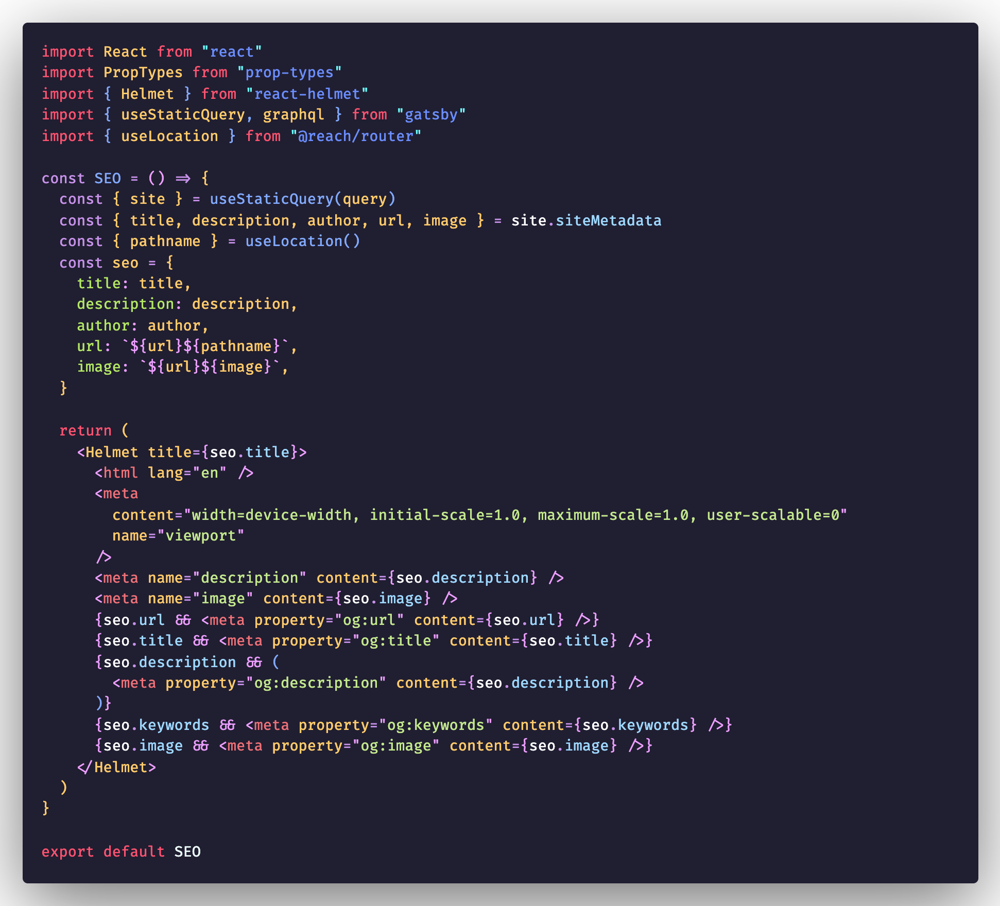

# Carbon theme

<!-- [](https://marketplace.visualstudio.com/items?itemName=mido-tawy.carbon-theme)
[](https://marketplace.visualstudio.com/items?itemName=mido-tawy.carbon-theme)
[](https://marketplace.visualstudio.com/items?itemName=mido-tawy.carbon-theme) -->

A Visual Studio Code theme that personally allow me to focus more. Better suited for those who like to code late into the night or simply like dark themes. Color choices are personal and as v0.0.1 subject to change with use, experiences and suggestions. ✨

## Installation

1.  Install [Visual Studio Code](https://code.visualstudio.com/)
2.  Launch Visual Studio Code
3.  Choose **Extensions** from menu
4.  Search for `ash theme`
5.  Click **Install** to install it
6.  Click **Reload** to reload the Code
7.  From the menu bar click: Code > Preferences > Color Theme > **Ash Theme**

## Screenshot
Screenshot of Typescript


## Misc

This is my first time creating a theme, so if you see something wrong, please feel free to [file an issue](https://gitlab.com/mohammed.tantawy/ash-dark-theme-vs-code/-/issues)!

The reason why I choose to publish on GitLab is because the images won't render since the path still points to 'master' instead of 'main' since the change.

Settings used for font
```sh
"editor.fontFamily": "FiraCode-Retina",
"editor.fontLigatures": true,
```

## Attributions

- Theme icon made by <a href="https://www.flaticon.com/authors/freepik" title="Freepik">Freepik</a> from <a href="https://www.flaticon.com/" title="Flaticon"> www.flaticon.com</a>