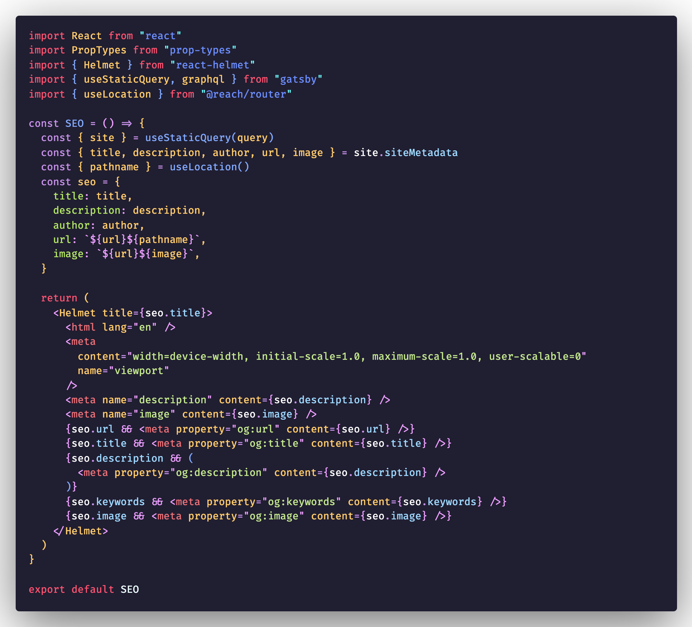
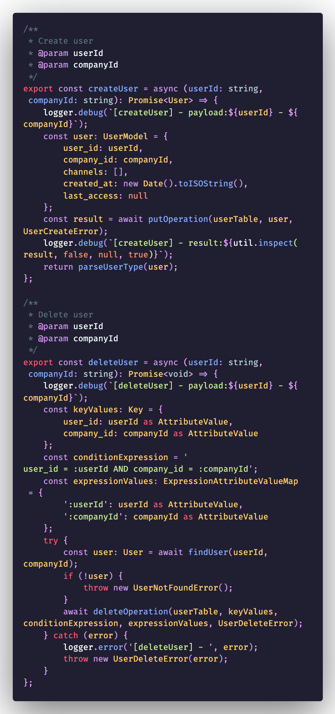

# Uplift theme

[](https://marketplace.visualstudio.com/items?itemName=mido-tawy.uplift-dark-theme)
[](https://marketplace.visualstudio.com/items?itemName=mido-tawy.uplift-dark-theme)
[](https://marketplace.visualstudio.com/items?itemName=mido-tawy.uplift-dark-theme)

A Visual Studio Code theme that personally allow me to focus more. The idea is that colors can allow us to identify things quicker and that helps me. Better suited for those who like to code late into the night or simply like dark themes. Color choices are personal and as v0.0.1 subject to change with use, experiences and suggestions. ✨

## Installation

1.  Install [Visual Studio Code](https://code.visualstudio.com/)
2.  Launch Visual Studio Code
3.  Choose **Extensions** from menu
4.  Search for `uplift theme`
5.  Click **Install** to install it
6.  Click **Reload** to reload the Code
7.  From the menu bar click: Code > Preferences > Color Theme > **Uplift Theme**

## Screenshot

Screenshot of React


Screenshot of Typescript


## Misc

This is my first time creating a theme, so if you see something wrong, please feel free to [file an issue](https://github.com/motawy/uplift-dark-theme/issues)!

Settings used for font
```json
"editor.fontFamily": "FiraCode-Retina",
"editor.fontLigatures": true,
```
## Note

The image might break on the marketplace since it points directly on 'master' which is no longer available. You can find the sample images [here](https://github.com/motawy/uplift-dark-theme/tree/main/images).
Also if you know how to fix this let me know! 🙌

## Attributions

- Theme icon made by <a href="https://www.flaticon.com/authors/freepik" title="Freepik">Freepik</a> from <a href="https://www.flaticon.com/" title="Flaticon"> www.flaticon.com</a>